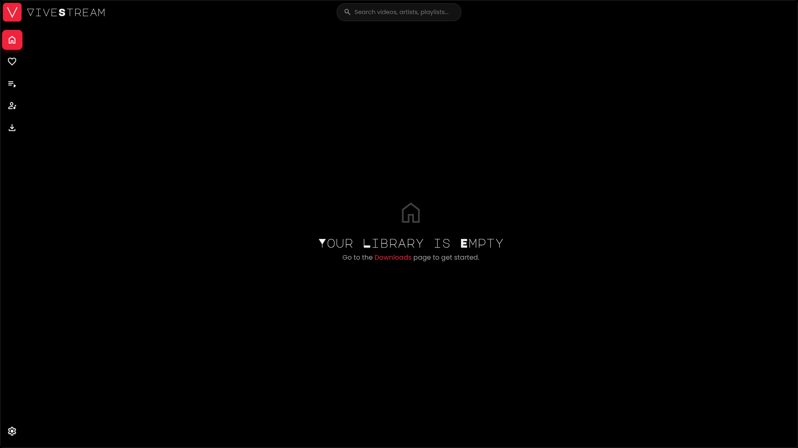

<div align="center">
  

---

  <p>
    <!-- Release Info -->
    <a href="https://github.com/Md-Siam-Mia-Man/ViveStream-Revived/releases">
      
    </a>
    <a href="https://github.com/Md-Siam-Mia-Man/ViveStream-Revived/blob/main/LICENSE">
      
    </a>
    
  </p>

  <p>
    <!-- Stats -->
    
    <a href="https://github.com/Md-Siam-Mia-Man/ViveStream-Revived/stargazers">
      
    </a>
    <a href="https://github.com/Md-Siam-Mia-Man/ViveStream-Revived/network/members">
      
    </a>
    
  </p>

<p>
<!-- Tech Stack -->
    
    
    
    
    
    
  </p>
</div>

Welcome! **ViveStream** is a modern, offline-first media player built for those who want to curate their own collection of videos and music. It downloads content using `yt-dlp`, organizes it into a robust local database, and provides a polished, high-performance interface for you to enjoy your media without ads, buffering, or an internet connection.



---

## 🚀 Core Features

- 📥 **Versatile Downloader:**
  - **YouTube & More:** Download videos and entire playlists from YouTube and other supported sites. ViveStream automatically creates local playlists for you.
  - **Smart Downloads:** Already have a video? ViveStream skips re-downloading it but updates its "date added" so it appears with the rest of its playlist.
  - **Import Local Files:** Add your existing media files from your computer directly into the ViveStream library. Thumbnails are automatically generated for local videos.
- ✂️ **Advanced Download Controls:**
  - Clip specific sections using start/end times.
  - Automatically split videos by their chapters into individual files.
  - Remove sponsored segments, intros, and outros with SponsorBlock integration.
  - Download subtitles for videos (official and auto-generated).
  - Use cookies from your browser to access members-only or age-restricted content.
- 📚 **Robust Library Management:**
  - **Powerful Search:** Instantly find what you're looking for with fuzzy search across videos, artists, and playlists. Results are neatly organized by category.
  - **Advanced Filtering:** Filter your library and favorites by media type (video/audio), duration, and source (YouTube/local).
  - **Full Metadata Control:** Edit titles, artists, and descriptions with a seamless inline editor directly on the player page.
  - **Playlists:** Create custom playlists, add media with a drag-and-drop interface, and upload custom cover images.
  - **Artists:** Media is automatically sorted by artist. Upload custom profile images for your favorite creators.
  - **Favorites:** A dedicated, filterable section for your most-loved content.
- 🎬 **High-Performance Integrated Player:**
  - **Context-Aware Queue:** When you play from a playlist, artist page, or favorites, the "Up Next" queue is intelligently populated and visually grouped.
  - **Gapless Playback:** Intelligent preloading ensures seamless, uninterrupted playback.
  - **Sleep Timer:** Set a timer to stop playback after a certain number of tracks, a set duration in minutes, or at a specific time of day.
  - **System Media Keys:** Control playback with your keyboard's media keys, even when the app is in the background.
  - **Full Feature Set:** Includes theater mode, fullscreen, miniplayer, playback speed control, and subtitle support.
- ⚙️ **Maintenance & Customization:**
  - **Smart Installer (Windows):** A professional setup experience with options to run on startup and launch after install.
  - **Visual Progress:** Monitor the progress of large file imports and library exports with a real-time progress bar.
  - **Export Library:** Save a copy of any media file or your entire library to another location, with files named by their proper titles.
  - **Reinitialize App:** A one-click function to clear the app's cache, rescan media files, and clean up any orphaned entries from the database.
- 📦 **All-in-One & Standalone:** No need to install Python, yt-dlp, or FFmpeg separately. Everything is bundled and ready to go via our **Portable Python Architecture**.

---

## 📥 Installation

### Recommended Method (Installer)

> **⚠️ Note:** If you are using ViveStream v7.6.0 or lower, please **uninstall** the old version before installing this one. Recent versions contain significant architectural changes. Installing on top of an old version may result in duplicate installations.

1. Go to the [**Releases**](https://github.com/Md-Siam-Mia-Man/ViveStream-Revived/releases) page.
2. Download the installer for your OS:
   - **Windows:** `ViveStream-Setup-x.x.x.exe`
   - **Linux:** `.AppImage`, `.deb`, or `.rpm`
   - **macOS:** `.dmg`
3. Run the installer.

#### 🗑️ Uninstallation & Data

- **Windows:** The uninstaller will ask if you want to keep or delete your media library and database.
- **Linux / macOS:** Due to OS limitations, uninstalling the app **does not** automatically remove your downloaded media (`~/ViveStream`) or database.
  - **Tip:** Go to **Settings > Danger Zone > Clear All Media** & **Delete Database** inside the app _before_ uninstalling if you want a clean slate.

---

## 💻 For Developers

See `docs/DEVELOPMENT.md` for detailed instructions and `docs/ARCHITECTURE.md` for a deep dive into the code.

1. **Clone the repository:**

   ```bash
   git clone https://github.com/Md-Siam-Mia-Man/ViveStream-Revived.git
   cd ViveStream-Revived
   ```

2. **Install dependencies:**
   _This automatically reassembles any large files via the `postinstall` hook._

   ```bash
   npm install
   ```

3. **Update/Hydrate Binaries (Optional but Recommended):**
   _Detects your OS and ensures `yt-dlp` and `static-ffmpeg` are up to date and executable._

   ```bash
   npm run env:update
   ```

4. **Run the application:**

   ```bash
   npm start
   ```

---

## 🎮 How to Use

1. **Download or Import Content**
   - Navigate to the **Downloads** page to fetch content from a URL.
   - Go to **Settings > Maintenance** and click **Import Files** to add local media from your computer.

2. **Manage Your Library**
   - The **Home** and **Favorites** pages display your media. Use the filter and sort buttons to refine your view.
   - The **Playlists** and **Artists** pages provide curated views. Click on a playlist or artist to see their content, where you can also upload custom cover images.
   - Use the global search bar at the top to find anything in your library.

3. **Enjoy Your Media**
   - Click any thumbnail to begin playback.
   - The "Up Next" queue will automatically show other videos from the context you started playback from (e.g., the rest of the playlist).

---

## ⌨️ Keyboard Shortcuts (Player)

| Key            | Action                 |
| -------------- | ---------------------- |
| `Space` or `K` | Play / Pause           |
| `M`            | Mute / Unmute          |
| `F`            | Toggle Fullscreen      |
| `T`            | Toggle Theater Mode    |
| `I`            | Toggle Miniplayer      |
| `←` / `→`      | Seek Back / Forward 5s |
| `↑` / `↓`      | Volume Up / Down       |
| `N`            | Play Next Media        |
| `P`            | Play Previous Media    |

---

## 🛠️ Build From Source

To package the application for your current platform:

```bash
# Automatically detects the platform and the build format
npm run build

# Windows (creates .exe installer)
npm run build:win

# Linux (creates AppImage, deb, rpm, flatpak, tar.gz)
npm run build:linux:all

# Linux (Docker). You must have docker installed and running for this
# This will create AppImage, deb, rpm, flatpak, tar.gz
npm run build:linux:docker
```

---

## ⚠️ Issues and Fixes

- Check out [BUILD_PREPERATION](./docs/BUILD_PREPERATION.md) for build related issues.

## 🤝 Contributing

Contributions are welcome! If you have an idea for a new feature or have found a bug, please feel free to fork the repository, make your changes, and open a Pull Request.

1. Fork the repo.
2. Create your feature branch (`git checkout -b feature/MyAwesomeFeature`).
3. Commit your changes (`git commit -m 'feat: Add MyAwesomeFeature'`).
4. Push to the branch (`git push origin feature/MyAwesomeFeature`).
5. Open a Pull Request.

---

## 📄 License

This project is licensed under the MIT License. See the [LICENSE](LICENSE) file for details.
